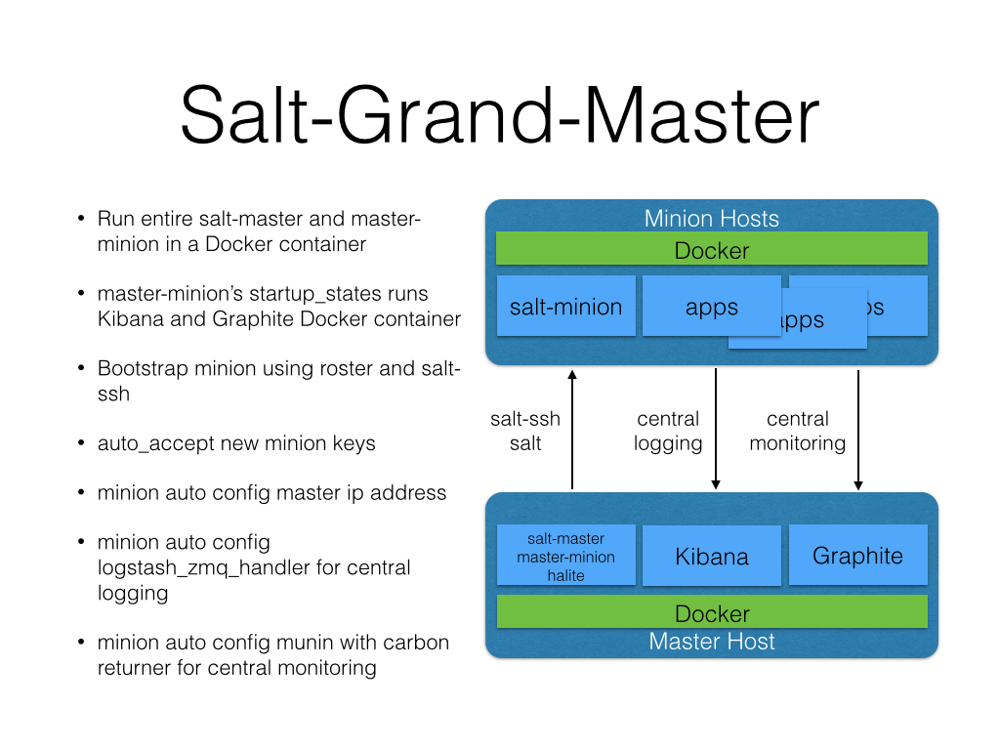

Run Salt-Master, Salt-Minion, and Halite inside Docker
Also runs Kibana/Logstash and Graphite insider their own containers.



####Halite/Salt UI

http://<master>:49080

####Kibana

http://<master>:49082

####Graphite

http://<master>:49880

###Instructions

1. edit file salt/master by changing master_ip to reflect the ip address of your master
2. run ```./build```
3. run ```./run```

###Boostrapping
ssh into the master ```ssh root@<master> -p 49022```, password is root

Create/Edit /etc/salt/roster file
```
<id>:
    host: <host name or ip>
    user: <user with sudo>
    passwd: <pwd>
    sudo: True
```

Also, make sure /etc/sudoers file is configured for NOPASSWD
```%admin ALL=NOPASSWD: ALL```


